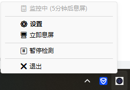

# 小黑 - 自动息屏助手

> 一款精致的 Windows 自动息屏工具，下班后智能检测无操作状态，自动关闭屏幕，节能减排好帮手。

<p align="left">
  
  
  
  
</p>

## ✨ 功能特性

- **无操作自动息屏**：检测到鼠标/键盘无操作达到设定时间（默认 10 分钟），自动关闭屏幕
- **息屏前友好提醒**：右下角弹出 Toast 通知，30 秒倒计时，可确认立即息屏或取消
- **智能时段控制**：仅下班后启用检测，工作时间自动禁用（默认 9:00-18:30）
- **一键息屏**：托盘右键菜单快速息屏，临时离开/会议结束必备
- **开机自启动**：支持开机自动运行，无需手动启动
- **精致设置界面**：现代化卡片 UI，滑块调参，直观易用

---

## 📸 应用截图

### 设置页面


### 息屏倒计时


### 系统托盘图标



---

## 📋 应用运行规则

### 1. 启动运行

- 双击 `小黑-AutoScreenOff.exe` 即可启动
- 首次启动自动弹出设置窗口，配置完成后最小化至系统托盘
- 支持开机自启（需在设置中手动开启）
- 同一时间仅允许一个实例运行，重复启动自动退出

### 2. 工作时间逻辑

- 默认 **09:00 ~ 18:30** 为工作时间，功能自动禁用，不检测无操作
- 其他时间段自动启用检测
- 上下班时间可在设置中自定义

### 3. 无操作检测规则

- 每秒检测一次用户输入活动（鼠标/键盘）
- 无操作时间 ≥ 设定值（默认 10 分钟）时触发提醒
- 检测阈值可配置（5~60 分钟）

### 4. 息屏提醒流程

- 右下角弹出 Toast 通知（圆角卡片样式，半透明背景）
- 显示倒计时（默认 30 秒），可随时点击「确认」立即息屏或「取消」终止
- 倒计时结束无操作 → 自动息屏

### 5. 息屏与唤醒

- **息屏方式**：硬件级关闭显示器电源（非屏保、非锁屏）
- **唤醒方式**：移动鼠标或按键盘任意键立即恢复，直接回到桌面
- **不影响**正在运行的程序

### 6. 暂停/恢复控制

- 右键托盘图标 →「暂停检测」：临时禁用，不触发息屏
- 右键托盘图标 →「恢复检测」：恢复正常监控

### 7. 配置保存

- 修改设置后点击「保存」立即生效
- 配置文件存储于 `~/.auto-screen-off/config.json`

---

## 🖱️ 系统托盘操作

| 操作 | 功能 |
|------|------|
| 双击托盘图标 | 打开设置窗口 |
| ⚙️ 设置 | 打开设置窗口 |
| 🖥️ 立即息屏 | 一键关闭屏幕 |
| ⏸️ 暂停检测 | 临时禁用监控 |
| ▶️ 恢复检测 | 恢复监控 |
| ❌ 退出 | 关闭程序 |

---

## ⚙️ 可配置参数

| 参数 | 默认值 | 说明 |
|------|--------|------|
| 无操作息屏时间 | 10 分钟 | 可调范围 5~60 分钟 |
| 下班时间 | 18:30 | 自定义 |
| 上班时间 | 09:00 | 自定义 |
| 提醒倒计时 | 30 秒 | 可调范围 10~60 秒 |
| 开机自启 | 关闭 | 开/关 |

---

## 📥 下载

前往 [Releases](../../releases) 页面下载最新版本。

| 文件 | 说明 |
|------|------|
| `小黑-自动息屏助手-v0.1.0.exe` | Windows 独立可执行文件，无需安装 Python 环境 |

---

## 安装使用

### 方式一：直接运行 exe

1. 下载 `小黑-AutoScreenOff.exe`
2. 双击运行
3. 首次启动会弹出设置窗口
4. 配置完成后最小化到系统托盘

### 方式二：从源码运行

```bash
# 1. 安装依赖
pip install -r requirements.txt

# 2. 运行程序
python src/main.py
```

### 打包 exe

```bash
python build.py
```

打包后的 exe 在 `dist/` 目录下。

---

## 💻 运行环境

| 项目 | 要求 |
|------|------|
| 操作系统 | Windows 10 (1809+) / Windows 11 |
| 内存占用 | < 50MB |
| CPU 占用 | < 1%（空闲状态） |
| 启动时间 | < 3 秒 |
| 多显示器 | 支持 |

---

## ❓ 常见问题

**Q：息屏后如何恢复？**  
A：移动鼠标或按键盘任意键即可

**Q：工作时间会息屏吗？**  
A：不会，工作时间（默认 9:00-18:30）功能自动禁用

**Q：息屏后会显示登录界面吗？**  
A：不会，完全黑屏，唤醒后直接回到桌面

**Q：如何完全退出程序？**  
A：右键托盘图标 → 退出

**Q：如何临时暂停检测？**  
A：右键托盘图标 → 暂停检测

---

## 开发

```bash
# 运行测试
pytest tests/ -v

# 查看代码覆盖率
pytest tests/ --cov=src --cov-report=html
```

## 许可证

MIT License
